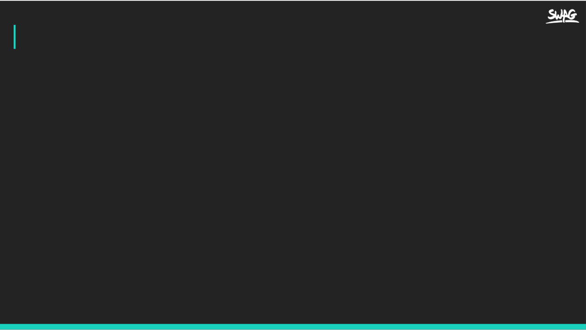

footer: nino.chang@**swag**.live
slidenumbers: true
build-lists: true

# [fit] **CI/CD with Google Cloud Build**

---
[.build-lists: false]


# Outline
- Canary deployment
- Cloud Deploy configuration
- Cloud Deploy scenarios
- Rollout with approval restriction
- Demo
- Integrate with current ci

---

# Canary deployment

![inline] (https://storage.googleapis.com/cdn.thenewstack.io/media/2017/11/a6324354-canary.gif)

---
[.build-lists: false]

# Canary deployment
- Deploy 2 version app at same time
- Configure load balancer route small amount of traffic to new version
- Monitor error rate see if new version is ok to rollout
- Rollout/Rollback according to monitor result

---

# Cloud deploy configuration
- skaffold.yaml: Skaffold configuration
- clouddeploy.yaml: Config **delivery pipeline** and **targets**

---

## Skaffold


---


skaffold.yaml

```yaml
apiVersion: skaffold/v4beta4
kind: Config
manifests:
  rawYaml:
  - kubernetes.yaml
deploy:
  kubectl: {}
verify:
- name: verification-curl
  container:
    name: verification-curl
    image: curlimages/curl:8.4.0
    command: ["sh", "-c"]
    args: ['response=$(curl -s my-service.default.svc.cluster.local/debug) && (echo "$response" | grep -q "bug") && exit 1 || exit 0']
  executionMode:
    kubernetesCluster: {}
```

---
[.code-highlight: 3-5]


skaffold.yaml - render manifest [^1]

```yaml
apiVersion: skaffold/v4beta4
kind: Config
manifests:
  rawYaml:
  - kubernetes.yaml
deploy:
  kubectl: {}
verify:
- name: verification-curl
  container:
    name: verification-curl
    image: curlimages/curl:8.4.0
    command: ["sh", "-c"]
    args: ['response=$(curl -s my-service.default.svc.cluster.local/debug) && (echo "$response" | grep -q "bug") && exit 1 || exit 0']
  executionMode:
    kubernetesCluster: {}
```
[^1]: [Skaffold render manifest](https://skaffold.dev/docs/renderers/)

---
[.code-highlight: 6-7]


skaffold.yaml - deploy [^2]

```yaml
apiVersion: skaffold/v4beta4
kind: Config
manifests:
  rawYaml:
  - kubernetes.yaml
deploy:
  kubectl: {}
verify:
- name: verification-curl
  container:
    name: verification-curl
    image: curlimages/curl:8.4.0
    command: ["sh", "-c"]
    args: ['response=$(curl -s my-service.default.svc.cluster.local/debug) && (echo "$response" | grep -q "bug") && exit 1 || exit 0']
  executionMode:
    kubernetesCluster: {}
```

[^2]: [Skaffold deploy](https://skaffold.dev/docs/deployers/)

---
[.code-highlight: 8-16]


skaffold.yaml - verify [^3]

```yaml
apiVersion: skaffold/v4beta4
kind: Config
manifests:
  rawYaml:
  - kubernetes.yaml
deploy:
  kubectl: {}
verify:
- name: verification-curl
  container:
    name: verification-curl
    image: curlimages/curl:8.4.0
    command: ["sh", "-c"]
    args: ['response=$(curl -s my-service.default.svc.cluster.local/debug) && (echo "$response" | grep -q "bug") && exit 1 || exit 0']
  executionMode:
    kubernetesCluster: {}
```

[^3]: [Skaffold test with verify](https://skaffold.dev/docs/verify/)

---


clouddeploy.yaml

```yaml
apiVersion: deploy.cloud.google.com/v1
kind: DeliveryPipeline
metadata:
  name: my-demo-app-single-region
description: main application pipeline
serialPipeline:
  stages:
  - targetId: cluster-dev
    profiles: []

---
apiVersion: deploy.cloud.google.com/v1
kind: Target
metadata:
  name: cluster-dev
description: development cluster
gke:
  cluster: projects/swag-nino-chang/locations/us-central1/clusters/quickstart-cluster-qsdev

```

---


# Deploy Scenario
- Single / Multi region
- Canary deploy

---


Single region

```yaml
apiVersion: deploy.cloud.google.com/v1
kind: DeliveryPipeline
metadata:
  name: my-demo-app-single-region
description: main application pipeline
serialPipeline:
  stages:
  - targetId: cluster-dev
    profiles: []

---
apiVersion: deploy.cloud.google.com/v1
kind: Target
metadata:
  name: cluster-dev
description: development cluster
gke:
  cluster: projects/swag-nino-chang/locations/us-central1/clusters/quickstart-cluster-qsdev

```

---


Multi region - **DeliveryPipeline**

```yaml
apiVersion: deploy.cloud.google.com/v1
kind: DeliveryPipeline
metadata:
  name: my-demo-app-multi-region
description: main application pipeline
serialPipeline:
  stages:
  - targetId: cluster-multi
    profiles: []
    deployParameters:
    - values:
        replicaCount: "1"
      matchTargetLabels:
        label1: label1
    - values:
        replicaCount: "2"
      matchTargetLabels:
        label2: label2

```

---
[.code-highlight: 10-18]


Multi region - **DeliveryPipeline**

```yaml
apiVersion: deploy.cloud.google.com/v1
kind: DeliveryPipeline
metadata:
  name: my-demo-app-multi-region
description: main application pipeline
serialPipeline:
  stages:
  - targetId: cluster-multi
    profiles: []
    deployParameters:
    - values:
        replicaCount: "1"
      matchTargetLabels:
        label1: label1
    - values:
        replicaCount: "2"
      matchTargetLabels:
        label2: label2

```

---


Multi region - **Targets**

```yaml
apiVersion: deploy.cloud.google.com/v1
kind: Target
metadata:
  name: cluster-multi
description: production clusters
multiTarget:
  targetIds: [cluster-production-a, cluster-production-b]
---
apiVersion: deploy.cloud.google.com/v1
kind: Target
metadata:
  name: cluster-production-a
  labels:
    label1: label1
description: production cluster 1
gke:
  cluster: projects/swag-nino-chang/locations/us-central1/clusters/quickstart-cluster-qsprod
---
apiVersion: deploy.cloud.google.com/v1
kind: Target
metadata:
  name: cluster-production-b
  labels:
    label2: label2
description: production cluster 2
gke:
  cluster: projects/swag-nino-chang/locations/us-west1/clusters/quickstart-cluster-qsprod2

```
---


Canary Deploy [^3]

```yaml
apiVersion: deploy.cloud.google.com/v1
kind: DeliveryPipeline
metadata:
  name: my-canary-demo-app-1
description: main application pipeline
serialPipeline:
  stages:
  - targetId: cluster-dev
    profiles: []
    strategy:
      canary:
        runtimeConfig:
          kubernetes:
            serviceNetworking:
              service: "my-service"
              deployment: "my-deployment"
        canaryDeployment:
          percentages: [50]
          verify: true
```

[^3]: [Cloud deploy - canary](https://cloud.google.com/deploy/docs/deploy-app-canary)

---
[.code-highlight: 10-19]


Canary Deploy

```yaml
apiVersion: deploy.cloud.google.com/v1
kind: DeliveryPipeline
metadata:
  name: my-canary-demo-app-1
description: main application pipeline
serialPipeline:
  stages:
  - targetId: cluster-dev
    profiles: []
    strategy:
      canary:
        runtimeConfig:
          kubernetes:
            serviceNetworking:
              service: "my-service"
              deployment: "my-deployment"
        canaryDeployment:
          percentages: [50]
          verify: true
```

---

Add **requireApproval: true** to enable approve.

```yaml
apiVersion: deploy.cloud.google.com/v1
kind: Target
metadata:
  name: cluster-production
description: production cluster
requireApproval: true
gke:
  cluster: projects/swag-nino-chang/locations/us-central1/clusters/quickstart-cluster-qsprod

```

---

# [fit] **DEMO**


---

# Demo Repo

[https://github.com/Robert-Rino/tool-kit/tree/master/cloud-deploy-gke](https://github.com/Robert-Rino/tool-kit/tree/master/cloud-deploy-gke)

---

# Integrate with current ci
Pre-rollout action canary

- Trigger on `master` merge, after image build action.
- Github action create cloud deploy canary release [^4]
- Create github deployment **canary**
- Approve request to slask **#dev-ops** channel

---

# Integrate with current ci
rollout action

- Trigger on github webhoook
- Advance release from **canary** to **stable**
- Remove github deployment **canary**
- Create github deployment **stable**

[^4]: [github action x cloud deploy integration](https://cloud.google.com/blog/products/devops-sre/using-github-actions-with-google-cloud-deploy)


---

# [fit] Q & A


<!-- ---
# Skaffold
- verify
- local development -->
