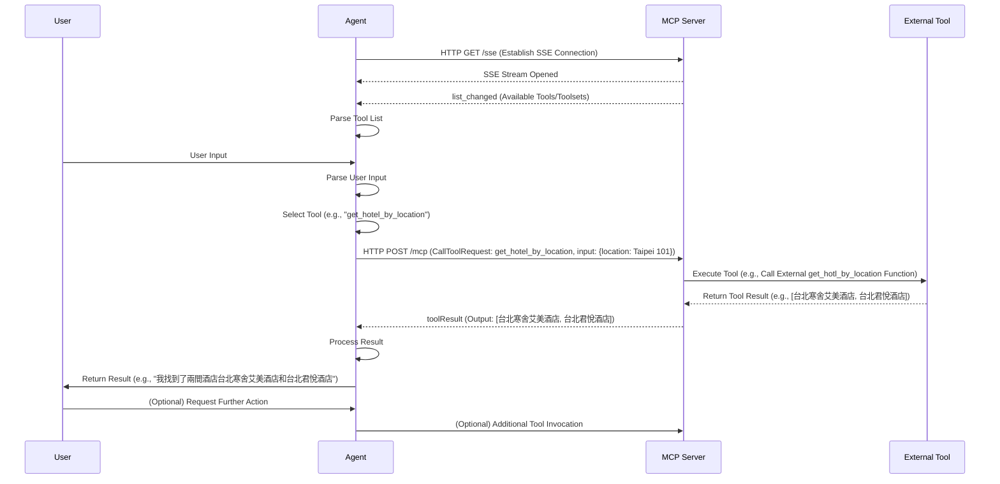

```mermaid
sequenceDiagram
    participant U as User
    participant A as Agent
    participant M as MCP Server
    participant T as External Tool

    A->>M: HTTP GET /sse (Establish SSE Connection)
    M-->>A: SSE Stream Opened
    M-->>A: list_changed (Available Tools/Toolsets)
    A->>A: Parse Tool List
    U->>A: User Input
    A->>A: Parse User Input
    A->>A: Select Tool (e.g., "get_hotel_by_location")
    A->>M: HTTP POST /mcp (CallToolRequest: get_hotel_by_location, input: {location: Taipei 101})
    M->>T: Execute Tool (e.g., Call External get_hotl_by_location Function)
    T-->>M: Return Tool Result (e.g., [台北寒舍艾美酒店, 台北君悅酒店])
    M-->>A: toolResult (Output: [台北寒舍艾美酒店, 台北君悅酒店])
    A->>A: Process Result
    A->>U: Return Result (e.g., "我找到了兩間酒店台北寒舍艾美酒店和台北君悅酒店")
    U->>A: (Optional) Request Further Action
    A->>M: (Optional) Additional Tool Invocation
```
