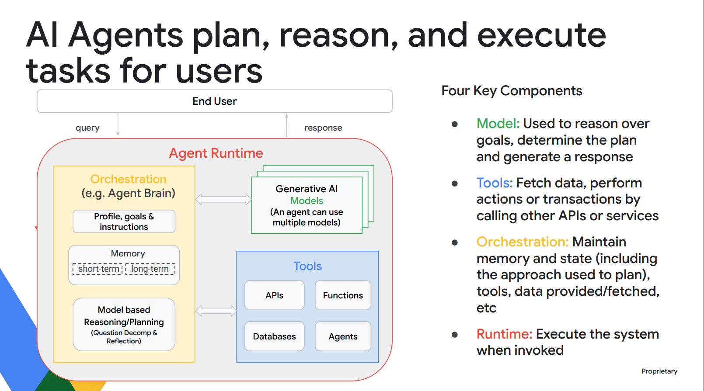

background-image: background-image.jpg
slidenumbers: true


# [fit] Agent and MCP

---

# [fit] What's Agent ?

---
# [fit] What's Agent ?

## Agents are applications that use 
## generative AI models 
## to think and act towards goals

---



---
[.build-lists: true]


- Who's Bill Gates :white_check_mark:
- What's the weather tomorrow ? :x:
- Help me book a hotel near Tokyo station for 3 nights, check in on 2025/9/1 :x:
- How many diamond does user `nino.user` purchases on swag.live :x:

---
# Tools
[.build-lists: true]

- APIs: Calling API fetch real world knowledge like weather forecasting
- Functions: Calculate mathmedical formula
- Databases: Fetch data from database
- **MCP**: Like a magical toolbox USB-C port :sunglasses:
- Agent: Communicate with other Agent to get desired information

---
# What's the weather tomorrow ?


---
# Book hotel


---
# How agent aware of tools they can use ?
- Through agent framework define series of tool.
- MCP 

---
# What's Model Context Protocol
MCP is an **open protocol that standardizes how applications provide context to LLMs**. 

Just as USB-C **provides a standardized way to connect your devices to various peripherals and accessories**.

MCP provides a standardized way to **connect AI models to different data sources and tools**.

---
## MCP server tools


---
# MCP Toolbox for Databases
[.footer: https://googleapis.github.io/genai-toolbox/resources/sources/#available-sources]


---
# Config hotel MCP server

```yaml
sources:
  booking-api:
    kind: http
    baseUrl: https://api.booking.com
    timeout: 10s
tools:
    debug:
      kind: http
      source: booking-api
      method: GET
      path: /debug
      description: Tool to send debug requests to the API
    get_hotel_by_location:
        kind: http
        source: booking-api
        method: GET
        path: /hotels
        description: Tool search hotels by location
        headers:
          Authorization: Bearer ${API_KEY}
          Content-Type: application/json
        queryParams:
          - name: city
            description: city to search for hotels
            type: string
toolsets:
  debug:
    - debug
  booking-service:
    - get_hotel_by_location
```

---
# Config hotel MCP server
[.code-highlight: 1-5]


```yaml
sources:
  booking-api:
    kind: http
    baseUrl: https://api.booking.com
    timeout: 10s
tools:
    debug:
      kind: http
      source: booking-api
      method: GET
      path: /debug
      description: Tool to send debug requests to the API
    get_hotel_by_location:
        kind: http
        source: booking-api
        method: GET
        path: /hotels
        description: Tool search hotels by location
        headers:
          Authorization: Bearer ${API_KEY}
          Content-Type: application/json
        queryParams:
          - name: city
            description: city to search for hotels
            type: string
toolsets:
  debug:
    - debug
  booking-service:
    - get_hotel_by_location
```


---
# Config hotel MCP server
[.code-highlight: 6, 7-12, 26, 27-28]


```yaml
sources:
  booking-api:
    kind: http
    baseUrl: https://api.booking.com
    timeout: 10s
tools:
    debug:
      kind: http
      source: booking-api
      method: GET
      path: /debug
      description: Tool to send debug requests to the API
    get_hotel_by_location:
        kind: http
        source: booking-api
        method: GET
        path: /hotels
        description: Tool search hotels by location
        headers:
          Authorization: Bearer ${API_KEY}
          Content-Type: application/json
        queryParams:
          - name: city
            description: city to search for hotels
            type: string
toolsets:
  debug:
    - debug
  booking-service:
    - get_hotel_by_location
```

---
# Config hotel MCP server
[.code-highlight: 6, 13-25, 26, 29-30]


```yaml
sources:
  booking-api:
    kind: http
    baseUrl: https://api.booking.com
    timeout: 10s
tools:
    debug:
      kind: http
      source: booking-api
      method: GET
      path: /debug
      description: Tool to send debug requests to the API
    get_hotel_by_location:
        kind: http
        source: booking-api
        method: GET
        path: /hotels
        description: Tool search hotels by location
        headers:
          Authorization: Bearer ${API_KEY}
          Content-Type: application/json
        queryParams:
          - name: city
            description: city to search for hotels
            type: string
toolsets:
  debug:
    - debug
  booking-service:
    - get_hotel_by_location
```

---
# How about MCP for **internal** database ?

> How many diamond does user `nino.user` purchases on swag.live :x:


---
# Config swag PostgresSQL tools

```yaml
authServices:
    my-google-auth:
        kind: google
        clientId: ${YOUR_GOOGLE_CLIENT_ID}
sources:
    swag-data:
        kind: postgres
        host: db
        port: 5432
        database: swag-data
        user: ${USER_NAME}
        password: ${PASSWORD}
tools:
    get_total_purchase_by_username:
        kind: postgres-sql
        source: swag-data
        description: Get user total purchase data by username
        parameters: 
        - name: username
          type: string
          description: The target username
        statement: SELECT username, SUM(amount) AS total FROM purchase_events WHERE username = $1 GROUP BY username;
```

---
# Built-in Google Oauth 2.0 Credential support

```yaml
authServices:
    my-google-auth:
        kind: google
        clientId: ${YOUR_GOOGLE_CLIENT_ID}
```

---
# Demo MCP tool with cursor

---
# Agent frameworks


---
# Recap
- Agents are applications that use generative AI models to think and act towards goals
- Tool represents a specific capability provided to an AI agent.
- MCP provides a standardized way to **connect AI models to different data sources and tools**, like USB.

---
# How do we make an Agent ? (ADK)
```python
mcp = ToolboxTool("http://localhost:8080")
tools = [
  *mcp.get_toolset("my-toolset"),
]

prompt = """
  You're a helpful hotel assistant. You handle hotel searching, booking and cancellations. 
  When the user searches for a hotel, mention it's name, id, location and price tier. 
  Always mention hotel ids while performing any searches. 
  Don't ask for confirmations from the user.
"""

# NOTE: Reuire envirinment variable GOOGLE_API_KEY
root_agent = Agent(
    model='gemini-2.0-flash',
    name='hotel_agent',
    description='A helpful AI assistant.',
    instruction=prompt,
    tools=tools,
)

session_service = InMemorySessionService()
runner = Runner(
    app_name='hotel_agent',
    agent=root_agent,
    artifact_service=InMemoryArtifactService(),
    session_service=session_service,
)

```

---
# How to invoke

```python
# Create session for individual conversation
session = session_service.create_session(
    state={}, app_name='hotel_agent', user_id='123'
)
# User prompt sent to agent.
query = "Find hotels in Basel with Basel in it's name."

# Pass query to agent.
events = runner.run(
    session_id=session.id, 
    user_id='123', 
    new_message=types.Content(role='user', parts=[types.Part(text=query)])
)

responses = (
    part.text
    for event in events
    for part in event.content.parts
    if part.text is not None
)

# Agent respond "Hilton Basel"
for text in responses:
    print(text) 

```

---
# MCP server as tool
```python
from google.adk.tools import LongRunningFunctionTool

# Define your long running function (see example below)
def ask_for_approval(
    purpose: str, amount: float, tool_context: ToolContext
) -> dict[str, Any]:
"""Ask for approval for the reimbursement."""
# create a ticket for the approval
# Send a notification to the approver with the link of the ticket
return {'status': 'pending', 'approver': 'Sean Zhou', 'purpose' : purpose, 'amount': amount, 'ticket-id': 'approval-ticket-1'}

# Wrap the function
approve_tool = LongRunningFunctionTool(func=ask_for_approval)
```


---
# Agent as tools 

---
# Architecture (LLM model interact with MCP server)


---
# MCP tool box
- configuration
- support source
- toolset

---
# Inspecting toolset


---
# Agent develop kit
- example code


---
# Control agent flow
- Multi-agent system
- Sequential agents
- Parallel agents
- Loop agents


---
# State Management

---
# Demo


---
# Questions ?

---
```text
You have access to a tool called `multiply` that multiplies two integers.
- Input: a (int), b (int)
- Output: The product of a and b as an integer.

Whenever you need to calculate the product of two numbers, use the `multiply` tool.
For example, if the user asks "What is 7 times 8?", call multiply(a=7, b=8).
```
