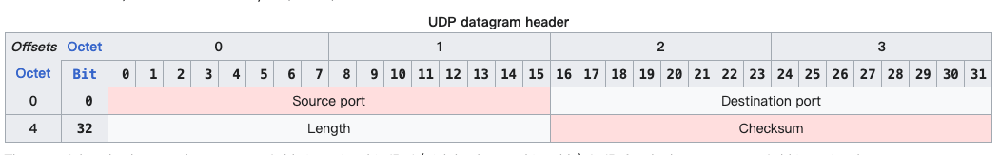
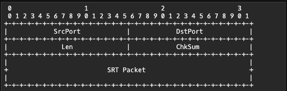
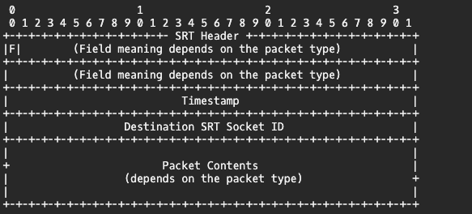

footer: **SWAG** backend team
slidenumbers: true
build-lists: false

# [fit] [TODO]一張圖開場，stream protocol 的演進

---

---

# Outline
- RTMP vs WebRTC vs SRT
- Deep dive into SRT
- Why we switch from RTMP to SRT
- DEMO

---

# [fit] Reminder download resource for demo.
[TODO] list of resource.

---
[.build-lists: false]

# RTMP 
- **TCP** based
- Supported codec:
    - video: H.264
    - audio: AAC
- Support first mile and last mile.
- RTMP still supported on many platform as first mile protocol.
    
---

# RTMP - Summary
- Pros:
    - Multicast support
    - Low buffering
- Cons:
    - Old codecs
    - Relative high latency (~30s)
    - Vulnerable to bandwidth and network issue.

---

# WebRTC

- **UDP** (default) and **TCP**
- Supported codec:
    - video: VP8, VP9, H.264
    - audio: Opus

- Products: 
    - Discord [^1]
    - Google meet

[^1]: [Discord blog discribe their webRTC architecture](https://discord.com/blog/how-discord-handles-two-and-half-million-concurrent-voice-users-using-webrtc)

---

# WebRTC - Connection Flow

1. Exchange SDP with **Signaling Server**
2. Collect **ICE candidates** with TURN server
3. Exchange ICE candidates
4. **UDP whole punching** estiblish connection

---

# WebRTC - Connection Flow

---

# WebRTC - TURN

^ If NAT or Firewall configuration doesn't allow peer connect directly, need rely on TURN server relay.

---

# WebRTC - SDP

- Session Description Protocol (SDP)
- Communicate **codec, address, media type, audio and video** between peers.

---

# WebRTC - ICE candidates

- Set of **public IP address and port** that could potentially be an address that receives data.
- Client will gathere them by making a series of requests to a STUN server.

---

# WebRTC - Summary

- Pros:
    - Sub-second latency
    - Stron security ensured by SRTP[^2]
    - Strong Community support, work on almost every browser
- Cons:
    - Maintain STUN and TURN server
    - Hard to scale when there's multi participants
    

[^2]: [Secure Real-Time Transport Protocol](https://datatracker.ietf.org/doc/html/rfc3711)

---

# SRT

- **UDP** based
- Supported codec: content agnostic
- Products

---

# SRT - Summary

- Pros:
    - Codec agnostic
    - AED encrypted content
    - High stability under bad network
- Cons:
    - Not support by native web, require special player.
    - Require extra bandwidth for SRT machanism maintain stream quality

---

| Protocol | RTMP | WebRTC | SRT |
| --- | --- | --- |--- |
| Supported codecs |H.264, AAC| H.264, VP9, VP8, Opus, G.711 G.722, iLBC, iSAC | Unlimited |
| Latency | < 5s | < 500ms | < 500ms|
| Security | Need Extension | Build in | Build in AES |
| Disruption Tolerance | Average | Good | Good |

---
[.build-lists: true]
# Quest: What video/audio codec does RTMP support ?

- video: H.264
- audio: AAC

---
# [fit] Deep dive into 
# [fit] **SRT**

---
# Deep dive into SRT
- Packet structure
- Handshake
- Acknowledgement and Loss Packet Handling
- Timestamp-Based Packet Delivery
- Too late packet

---
# Packet structure

- Transmitted as UDP payload
- Acting as a wrapper around content so that it's content agnostic

---

---

---
# Handshake

- SRT Socket IDs
- SRT Buffer Latency
- Initial RTT value estimation
- Initial TSBPD time base value calculation
- Stream encryption key

---
# Acknowledgement and Loss Packet Handling
[TODO]
- ARQ / FEC
- ACK / ACKACK / NACK
- Too Late packet trigger ACK

---
# Timestamp-Based Packet Delivery

- **Reproduce** the timing of packets committed by the sending application to the SRT sender on **receiver** side.
- Allows packets to be **scheduled** for delivery by the SRT **receiver** making them ready to be read by the receiving application 

---
# Packet Delivery Time
[TODO]
- Describe fomulla.

---

---
# [TODO] Quest: packet delivery time 

---
# Too late packet

[TODO] too late packet on sender/receiver side.

---

# WebRTC References:
- https://medium.com/agora-io/how-does-webrtc-work-996748603141
- https://www.100ms.live/blog/webrtc-turn-server

---

# DEMO
