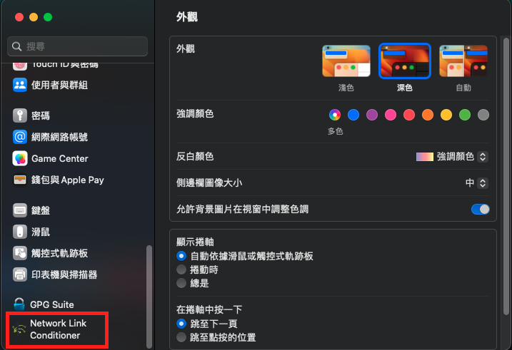

footer: **SWAG** backend team
slidenumbers: true
build-lists: false

# [fit] Go download **demo** resource.

https://tinyurl.com/2024-q1-swag-openday-setup

SWAG - Guest
password: *helloswag*

---

^自我介紹，Nino 報告, WeiHsin Demo

---

^RTMP: 1996, include RTMPS
WebRTC: 2011
FTL: 2016 - 2020
SRT: 2017
Enhanced RTMP: 2022

---

# Outline
- RTMP vs WebRTC vs SRT
- What protocol are we using and why ?
- Deep dive into SRT
- DEMO

---

# Outline
- RTMP vs WebRTC vs SRT :arrow_backward:
- What protocol are we using and why ? 
- Deep dive into SRT 
- DEMO

---
[.build-lists: false]

# RTMP 
- **TCP** based
- Supported codecs:
    - video: H.264
    - audio: AAC
- Latency (3 ~ 5s)
- RTMP still supported on many platform as publish protocol even though flash player is offically dead.

^- TCP focus on reliability over latency, it ensure packet arrive sequentially, this overhead introduce higher latency.
- Mention TCP head of line block.
    
---

# RTMP - Pros & Cons
- Pros:
    - High platform/encoder compatibility
    - Low resource usage since TCP took care of packets ordering.
- Cons:
    - Old codecs[^1]
    - Vulnerable to bandwidth and network issues.

[^1]: [RTMP Extended](https://github.com/veovera/enhanced-rtmp)

^ - Adobe stopped updating RTMP and didn't submit to RFC.
- 完全依賴 TCP 處理 loss packet, 容易在網路不穩情況受 congestion control 影響造成 delay.
- Enhanced-RTMP support VP9, HEVC, and AV1[^Enhanced-RTMP]

---

# WebRTC
- It's a **framework** in combination of protocols and JS APIs.
- **UDP** (default) and **TCP** (TURN)
- Supported codecs:
    - video: VP8, VP9, H.264 (H.265, AV1 ... in progress)
    - audio: Opus (... in progress)
- Latency (< 500ms)
- Products: Discord [^2] ,Google meet

[^2]: [Discord blog discribe their webRTC architecture](https://discord.com/blog/how-discord-handles-two-and-half-million-concurrent-voice-users-using-webrtc)

^Webrtc
- protocols: ICE, SDP, DTLS
- APIs: allow web developers to integrate real-time communication features.

---

# WebRTC - Pros & Cons

- Pros:
    - High stability under bad network conditions
        - Adaptive Bitrate Control, FEC, NACK
    - Strong community support, works on almost every browser.
    - Strong security ensured by DTLS, SRTP
- Cons:
    - Hard to scale when there's multiple participants
    

^ - Adaptive Bitrate Control: 依照網路狀況動態調整encode bitrate.
[Datagram Transport Layer Security](https://datatracker.ietf.org/doc/html/rfc6347)
[Secure Real-Time Transport Protocol](https://datatracker.ietf.org/doc/html/rfc3711)

---

# SRT

- **UDP** based
- Supported codec: Codec agnostic
- Latency: (< 500ms)
- Timestamp-Based Packet Delivery (TSBPD): Ensures correct packet ordering.
- Loss packet handling: FEC, ARQ, Too-late packet

---

# SRT - Pros & Cons

- Pros:
    - Codec agnostic.
    - High stability under bad network conditions.
    - Strong security ensured by built-in AES.
- Cons:
    - Not support by native web, require special player.
    - Require extra bandwidth for SRT mechanism maintain stream quality.

---
[.build-lists: true]
# [fit] Codec Limitations
RTMP

- Was developed alongside Flash, which heavily utilized FLV for video playback
- FLV use h.264, aac 

---
[.build-lists: true]
# [fit] Why there's limitation for codec ?
WebRTC

- Relies codecs to be supported by underlying browser.
- Browsers don't support specific codecs for various reasons, like expensive license to use H.265.
- Hardware acceleration requirement for some codecs like H.265, AV1 
(But newer chrome starts support hardware acceleration)

---
[.build-lists: true]
# [fit] Why there's limitation for codec ?

SRT

- It doesn't have any codecs limitation on data processing, 
the responsibility of encoding/decoding fall on upstream/downstream app using SRT.
- Acts as a normal udp packet that wraps SRT content.

---

| Protocol             | RTMP       | WebRTC                                         | SRT            |
|----------------------|------------|------------------------------------------------|----------------|
| Supported Codecs     | H.264, AAC | H.264, VP9, VP8, Opus | Unlimited      |
| Latency              | < 5s       | < 500ms                                        | < 500ms        |
| Security             | RTMPS      | Built in (DTLS, SRTP)                          | Built in (AES) |
| Disruption Tolerance | Average    | Good                                           | Good           |

---
[.build-lists: true]
# [fit] Quiz 1: What video/audio codec does 
# [fit] **RTMP** support ?

- video: H.264
- audio: AAC

---

# Outline
- RTMP vs WebRTC vs SRT :white_check_mark:
- What protocol are we using and why ? :arrow_backward:
- Deep dive into SRT
- DEMO

---
# [fit] **What** protocol are we using
# [fit] and **why**

---

# Publish protocol we used
- RTMP: 2020 ~ Now
- SRT:  2023.11 ~ Now

---

# Why we chose RTMP at the very beginning

- RTMP is broadly supported by community, sufficient resource.
- WebRTC scenario is mostly for peer to peer, ours scenario is broadcast.
- SRT support was limited

-----

# Why we switch to SRT

- SRT is more stable under bad internet.
- Better support for new codecs

---
# [fit] Real World Comparisons: RTMP vs SRT
- Publisher: iPhone 14pro / Larix, 台哥大5G.
- Playback: VLC playing HLS manifest.

---
# Elevator - SRT vs RTMP

---
# Underground - SRT vs RTMP

---
# Outline
- RTMP vs WebRTC vs SRT :white_check_mark:
- What protocol are we using and why ? :white_check_mark:
- Deep dive into SRT :arrow_backward:
- DEMO

---
# [fit] Deep dive into **SRT**

- Timestamp-Based Packet Delivery :arrow_backward:
- Handle loss packet
- Too late packet

---
[.build-lists: true]

# Timestamp-Based Packet Delivery
- Timestamps allow the receiver to **reorder** packets before handover to decoder.
- Ensuring packets are delivered to the decoder in the correct order

--- 
# Correct order of packets matters
[.footer: https://qiita.com/tomoyafujita/items/2e10a9b9d463a36d4a3e]
 

---
[.footer: https://qiita.com/tomoyafujita/items/2e10a9b9d463a36d4a3e]

^ 每個packet都會有serial number
- 這邊要帶到Packet Delivery Time.

---
[.build-lists: true]
# Packet Delivery Time

$$PktTsbpdTime = TsbpdTimeBase + PktTimestamp + TsbpdDelay + Drift$$

- $$TsbpdTimeBase$$ : Time base reflects the time difference between local clock of the receiver and the sender
- $$PktTimestamp$$ : Data packet timestamp
- $$TsbpdDelay$$ : SRT Latency, negotiated between sender and receiver on handshake.
- $$Drift$$ : Adjust the fluctuations between sender and receiver clock.

---
| Serial Number | Pkt Timestamp | Time Base | SRT Latency | Drift | Packet Delivery Time |
|---------------|---------------|-----------|-------------|-------|----------------------|
| 1             | 20            | 40        | 120         | 0     | 180                  |
| 2             | 40            | 40        | 120         | 0     | 200                  |
| 4             | 80            | 40        | 120         | 0     | 240                  |
| 5             | 100           | 40        | 120         | 0     | 260                  |
| 3             | 60            | 40        | 120         | 0     | 220                  |

^ 想像Receiver 端收到1~5 packate, 計算Packet Delivery Time 的範例。

---
[.build-lists: true]
# [fit] Quiz 2: packet delivery time 

| Serial Number | Pkt Timestamp | Time Base | SRT Latency | Drift | Packet Delivery Time |
|---------------|---------------|-----------|-------------|-------|----------------------|
| 6             | 120           | 40        | 120         | 0     | ???                  |
| 7             | 140           | 40        | 120         | 0     | ???                  |

- 6: 280
- 7: 300

---
# [fit] Deep dive into **SRT**

- Timestamp-Based Packet Delivery :white_check_mark:
- Handle loss packet :arrow_backward:
- Too late packet

---
[.build-lists: true]

# [fit] Handle loss packet
Automatic Repeat Request (ARQ)

- Whenever receiver detects packet loss it send NACK to sender to trigger packet retransmission.
- If packet still in sender's buffer and not determined too late, it will be schedule into queue for sending.
- Periodical packet loss report.

---
[.build-lists: true]

# [fit] Handle loss packet
Forward Error Correction (FEC): 

- Add *redundant information* to the transmitted packets, Allowing receiver to *reconstruct* lost packets even if they are not received.

---
# [fit] Deep dive into **SRT**

- Timestamp-Based Packet Delivery :white_check_mark:
- Handle loss packet :white_check_mark:
- Too late packet :arrow_backward:

---
[.footer: https://qiita.com/tomoyafujita/items/2e10a9b9d463a36d4a3e]

---
[.build-lists: true]

# Too Late Packet
- **Receiver** will "skip" this packet and send a fake ACK packet to the sender
- **Sender** will drop packets that have no chance to be delivered in time.
- Packet is considered "too late" if the packet timestamp is older than **TlPktDropThreshold**

---

---

---

---

---
- $$NOW = 200$$
- $$TlPktDropThreshold = 150$$

| Serial Number | PktTimestamp | Is Too Late |
|---------------|--------------|-------------|
| 1             | 20           | Y           |
| 2             | 40           | Y           |
| 3             | 60           | N           |
| 4             | 80           | N           |
| 5             | 100          | N           |

^ 假設這是一個sender 的 buffer, 哪些packet too late ?

---

---
# [fit] Quiz 3: Which delivery is too late ?
[.build-lists: true]

| Now | Serial Number    | PktTimestamp | Is Too Late |
|------|------------------|--------------|-------------|
| 140  | 3                | 60           | ?           |
| 160  | 3 (retransmit-1) | 60           | ?           |
| 180  | 3 (retransmit-2) | 60           | ?           |
| 200  | 3 (retransmit-3) | 60           | ?           |

- $$TlPktDropThreshold = 125$$
- ANS: retransmit-3 is too late.

^ 怎麼算？ Time - 125 < 60
 Time < 185 is not too late

---

---

---

---

---

# [fit] Deep dive into **SRT**

- Timestamp-Based Packet Delivery :white_check_mark:
- Handle loss packet :white_check_mark:
- Too late packet :white_check_mark:

---- 

# **Challenges** when switching to **SRT**

- Required variable tuning
- Cloud routing behavior for UDP

^- Required variable tuning
    - SRT latency
    - Max Bandwidth

---

# Outline
- RTMP vs WebRTC vs SRT :white_check_mark:
- What protocol are we use, why ? :white_check_mark:
- Deep dive into SRT :white_check_mark:
- DEMO :arrow_backward:

---

# DEMO - SRT vs. RTMP

- Control Variables
    - Output Video bitrate: **4 Mbps**
    - Output Audio bitrate: **192 Kbps**
    - Resolution: **1280 x 720**
    - FPS: **30**
    - Outbound bandwidth: **6 Mbps** (=768KB)
- Independent Variable
    - Outbound Packet Loss Rate

---

# Workshop
- Push stream - *OBS* :arrow_backward:
- Watch stream - *VLC* 
- Network conditioning

---
Click *+*

---
Click *媒體來源*

---
Click *確定*

---
Click *瀏覽* to select the video, enable *循環* and click *確定*

---
Click *設定檔* and *匯入*

---
Select the *swagconfig* folder and click *open* 

---
Click *設定檔* and select *swag-config*

---
Click *設定*

---
Click *串流* and set [服務] to *自訂...* and [伺服器] to *the copied connection string*, then click *確定*

---
Start streaming

---
# Workshop
- Push stream - `OBS` :white_check_mark:
- Watch stream - `VLC` :arrow_backward: 
- Network conditioning

---
Click *File* and select *Open Network*

---
Copy and paste *stream url* , and click *Open*

---
# Workshop
- Push stream - `OBS` :white_check_mark:
- Watch stream - `VLC` :white_check_mark:
- Network conditioning :arrow_backward:

---
Open *setting*

---
Select *Network Link Conditioner* on the left side

---
Click *Mange Profiles*

---
Click *+* to add custom profile

---
Enter a name, and click *Create*

---
Uplink bandwidth: *10Mbps*
Uplink Packets Dropped: *1 %*

---
Turn *ON* to start network controlling

---
Windows - open *clumsy*

---
Presets: *all sending packets*
Drop: *1%* for outbound
Bandwidth: *768 KB/s* for outbound (equals to *6 Mb/s*)( 768 * 8 / 1024 = 6)

---
# [fit] How high can the
# [fit] **packet loss rate** be
# [fit] until the stream is unusable ?

---
# Workshop
- Push stream - `OBS` :white_check_mark:
- Watch stream - `VLC` :white_check_mark:
- Network conditioning :white_check_mark:

---

# RTMP References:
- https://www.wowza.com/blog/history-of-streaming-media
- https://ossrs.net/lts/zh-cn/docs/v5/doc/rtmp
- https://resi.io/blog/what-is-rtmp-and-alternatives/

---

# WebRTC References:
- https://medium.com/agora-io/how-does-webrtc-work-996748603141
- https://www.100ms.live/blog/webrtc-turn-server
- https://webrtcforthecurious.com/docs/04-securing/
- https://webrtc.mthli.com/basic/ice-stun-turn/

---
# SRT References:
- https://github.com/Haivision/srt?tab=readme-ov-file
- https://qiita.com/tomoyafujita/items/2e10a9b9d463a36d4a3e
- https://github.com/Haivision/srt-rfc/blob/main/notes/notes_data_transmission.md

