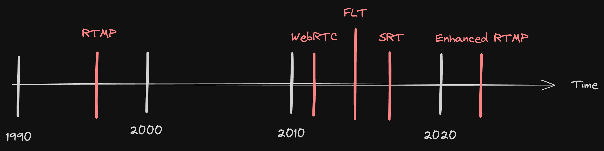

footer: **SWAG** backend team
slidenumbers: true
build-lists: false

# [fit] Go download **demo** resources.
- https://shortlink/resource.
- An QRCode

---

---

# Outline
- RTMP vs WebRTC vs SRT
- Deep dive into SRT
- What protocol are we use, why ?
- DEMO

---
[.footer: https://www.wowza.com/blog/history-of-streaming-media]

---
[.build-lists: false]

# RTMP 
- **TCP** based
- Supported codecs:
    - video: H.264
    - audio: AAC
- Latency (3 ~ 5s)
- RTMP still supported on many platform as publish protocol even though flash player is offically dead.
    
---

# RTMP - Summary
- Pros:
    - High device compatabillity
    - Low resource usage due to TCP packets ordering.
- Cons:
    - Old codecs[^1]
    - Vulnerable to bandwidth and network issues.

[^1]: [RTMP Extended](https://github.com/veovera/enhanced-rtmp)

^ 
- Adobe stop update RTMP and didn't submit to RFC.
- 完全依賴TCP 處理 loss packet, 容易在網路不穩情況受 congestion control 影響造成 delay.
- Enhanced-RTMP support VP9, HEVC, and AV1[^Enhanced-RTMP]

---

# WebRTC

- **UDP** (default) and **TCP** (TURN)
- Supported codecs:
    - video: VP8, VP9, H.264 (H.265, AV1 ... in progress)
    - audio: Opus (... inprogress)
- Latency (< 500ms)
- Products: Discord [^2] ,Google meet

[^2]: [Discord blog discribe their webRTC architecture](https://discord.com/blog/how-discord-handles-two-and-half-million-concurrent-voice-users-using-webrtc)

---
[.build-lists: true]

# Why WebRTC is not codec agnostic ?
- Relies codecs supported by underlying browser.
- Browsers don't support specific codecs for various reasons, like expensive license to use H.265.
- Hardware acceleration requirement for some codecs like H.265, AV1 
(But newer chrome starts support hardware acceleration)

---
[.build-lists: true]

# How does WebRTC handle packet loss ?
- Forward Error Correction (FEC): Add **redundant information** to the transmitted packets, Allowing receiver to **reconstruct** lost packets even if they are not received.

- NACK: Notify sender to retransmit missing packets and fill in the gaps to maintain playback continuity.

- Adaptive Bitrate Control: Dynamically adjust the bitrate of the transmitted media stream based on network conditions.

---

# WebRTC - Summary

- Pros:
    - High stability under bad network
    - Strong Community support, work on almost every browser.
    - Strong security ensured by DTLS[^3], SRTP[^4]
- Cons:
    - Hard to scale when there's multi participants
    

[^3]: [Datagram Transport Layer Security](https://datatracker.ietf.org/doc/html/rfc6347)

[^4]: [Secure Real-Time Transport Protocol](https://datatracker.ietf.org/doc/html/rfc3711)

---

# SRT

- **UDP** based
- Supported codec: codec agnostic
- Latency: (< 500ms)
- Loss packet handling: FEC, ARQ, Too-late packet
- Timestamp-Based Packet Delivery (TSBPD), optimize decoder performance.

---
[.build-lists: true]

# Why SRT codec agnostic ?
- It doesn't have any codecs limitation on data processing, 
the responsibility of encoding/decoding fall on upstream app using SRT.
- Acts as a normal udp packet that wraps SRT content.

---

# SRT - Summary

- Pros:
    - Codec agnostic
    - High stability under bad network conditions
    - Strong security ensured by built-in AES.
- Cons:
    - Not support by native web, require special player.
    - Require extra bandwidth for SRT machanism maintain stream quality

---

| Protocol | RTMP | WebRTC | SRT |
| --- | --- | --- |--- |
| Supported Codecs |H.264, AAC| H.264, VP9, VP8, Opus, G.711 G.722, iLBC, iSAC | Unlimited |
| Latency | < 5s | < 500ms | < 500ms|
| Security | RTMPS/RTMPE | Built in (DTLS, SRTP) | Built in (AES) |
| Disruption Tolerance | Average | Good | Good |

---
[.build-lists: true]
# [fit] Quiz 1: What video/audio codec does 
# [fit] **RTMP** support ?

- video: H.264
- audio: AAC

---
# [fit] Deep dive into
# [fit]  **SRT**

---
[.footer: https://qiita.com/tomoyafujita/items/2e10a9b9d463a36d4a3e]

^ 每個packet都會有serial number

---

# Timestamp-Based Packet Delivery
- Timestamps allow the receiver to **reorder** packets before handover to decoder.
- Ensuring packets are decoded and displayed in the correct order

--- 
# Correct order of packets matters
 

--- 
[.build-lists: true]

# Automatic Repeat Request (ARQ)
- Whenever receiver detects packet loss it send NACK to sender to trigger packet retransmission.
- If packet still in sender's buffer and not determined too late, it will be schedule into queue for sending.
- Periodically packet loss report.

---
[.build-lists: true]
# Packet Delivery Time

$$PktTsbpdTime = TsbpdTimeBase + PktTimestamp + TsbpdDelay + Drift$$

- $$TsbpdTimeBase$$ : Time base reflects the time difference between local clock of the receiver and the sender
- $$PktTimestamp$$ : Data packet timestamp
- $$TsbpdDelay$$ : SRT Latency, negotiated between sender and receiver on handshake.
- $$Drift$$ : Adjust the fluctuations between sender and receiver clock.

---

| Serial Number | Pkt Timestamp | Time Base | SRT Latency | Drift | Packet Delivery Time |
|---------------|---------------|-----------|-------------|-------|----------------------|
| 1             | 20            | 40        | 120         | 0     | 180                  |
| 2             | 40            | 40        | 120         | 0     | 200                  |
| 5             | 100           | 40        | 120         | 0     | 260                  |
| 3             | 60            | 40        | 120         | 0     | 220                  |
| 4             | 80            | 40        | 120         | 0     | 240                  |

^ 想像Receiver 端收到1~5 packate, 計算Packet Delivery Time 的範例。

---
[.build-lists: true]
# [fit] Quiz 2: packet delivery time 

| Serial Number | Pkt Timestamp | Time Base | SRT Latency | Drift | Packet Delivery Time |
|---------------|---------------|-----------|-------------|-------|----------------------|
| 6             | 120           | 40        | 120         | 0     | ???                  |
| 7             | 140           | 40        | 120         | 0     | ???                  |

- 6: 00:00:00,280
- 7: 00:00:00,300

---
[.footer: https://qiita.com/tomoyafujita/items/2e10a9b9d463a36d4a3e]

---
[.build-lists: true]

# Too Late Packet
- **Receiver** will "skip" this packet and send a fake ACK packet to the sender
- **Sender** will drop packets that have no chance to be delivered in time.
- Packet is considered "too late" if the packet timestamp is older than **TlPktDropThreshold**

---

---
- $$NOW = 200$$
- $$TlPktDropThreshold = 150$$

| Serial Number | PktTimestamp | Is Too Late |
|---------------|--------------|-------------|
| 1             | 20           | Y           |
| 2             | 40           | Y           |
| 3             | 60           | N           |
| 4             | 80           | N           |
| 5             | 100          | N           |

^ 假設這是一個sender 的 buffer, 哪些packet too late ?

---
# [fit] Quiz 3: Starts from with is too late ?
[.build-lists: true]

| Time | Serial Number    | PktTimestamp | Is Too Late |
|------|------------------|--------------|-------------|
| 140  | 3                | 60           | ?           |
| 160  | 3 (retransmit-1) | 60           | ?           |
| 180  | 3 (retransmit-2) | 60           | ?           |
| 200  | 3 (retransmit-3) | 60           | ?           |

- $$TlPktDropThreshold = 125$$
- ANS: retransmit-3 is too late.

^ 怎麼算？ Time - 125 < 60
 Time < 185 is not too late

---
# What protocol do we use, why ?

---

# Why we select RTMP over WebRTC at very beginning

- WebRTC scenario is for peer to peer, ours are broadcast.
- RTMP is broadly support by community, sufficient resource.

-----

# Why we switch to SRT

- SRT is more stable under bad internet.
- Lack of newer codecs support

---
# [fit] Real World Compareison video RTMP vs SRT.

---- 

# What problem did we encounter switching SRT

- Variable tuning
- Client support ?

---

# RTMP References:
- https://www.wowza.com/blog/history-of-streaming-media
- https://ossrs.net/lts/zh-cn/docs/v5/doc/rtmp
- https://resi.io/blog/what-is-rtmp-and-alternatives/

---

# WebRTC References:
- https://medium.com/agora-io/how-does-webrtc-work-996748603141
- https://www.100ms.live/blog/webrtc-turn-server
- https://webrtcforthecurious.com/docs/04-securing/
- https://webrtc.mthli.com/basic/ice-stun-turn/

---
# SRT References:
- https://github.com/Haivision/srt?tab=readme-ov-file
- https://qiita.com/tomoyafujita/items/2e10a9b9d463a36d4a3e
- https://github.com/Haivision/srt-rfc/blob/main/notes/notes_data_transmission.md

---

# DEMO
